# DevOps Engineer

##  Virtual Machine and Linux

---

### Day 1 - Virtual Machine

**Focus**: Today's learning focus was on Virtual Machine

**Progress**:

- Installing Ubuntu Linux version 20.04
- Installing VirtualBox and Vagrant
- Using vagrant to create a centos virtual server
- getting familiar with the vagrant commands
- Learn about type 1 and 2 hypervisor

**Thoughts**: Today's learning was super hands-on. It was create a joy playing installing different OSes on the host computer. I installed a web server, creating a public network, and access the web server from another computer. That was fun.

**Work & Resources**:
- [Public Network](https://www.vagrantup.com/docs/networking/public_network)
- [Vagrant commands](resources/docs/vagrant/command.md)

---

### Day 2 - Linux

**Focus**: Today's learning focus on understanding the Linux Operating system

**Progress**:

- Setting up a Raspberry pi 4 with Ubuntu server 20.04
- Understanding what an Operating System is 
- User --> Operating System --> Hardware
- Getting to know the Linux File System Hierarchy
- Getting familiar with the Linux shell commands
- The Linux boot process

**Thoughts**: Today's learning was more theoretical in nature. It was a joy reviewing the the boot process, kernel, init, process management, scheduling, etc. Login to the Ubuntu linux shell and navigate to different part of the file system. playing with command such dmesg, cat /proc/cpuinfo, etc. I had lots of fun.

**Work & Resources**:
- [Linux Boot Process](https://www.thegeekstuff.com/2011/02/linux-boot-process/)

---

## Day 3 - Files and Directories

**Focus**: Today's learning focus on Linux File and Directories

**Progress**:

- Basic Linux commands
- Read File
- Create and delete file/directory
- using apt to install applications

**Thoughts**: Today was a review for me. 

**Work & Resources**:
- [Files and directories](resources/docs/linux/file-dir.md)

---

## Day 4 - Manage Files and Directories

**Focus**: Today's learning focus on managing file and directories

**Progress**:

- Copy files and directories
- Renaming and moving file
- Search files using find, diff, and file
- using grep to search a word
- Using the powerful sed command search file

**Thoughts**: Today was a review for me. This time I spend lots of time experimenting with sed.

**Work & Resources**:
-  None

---

## Day 4 - User Management

**Focus**: Today's learning focus on managing users

**Progress**:

- Understand the different type of users in Linux
- practicing creating user using the adduser command
- using usermod to modify a user account
- making sense of file permissions
- Changing permissions and ownership of files and directories

**Thoughts**: Again this is another review day for me. Each I review this stuff I have a different perspective of things. I got to really experiment the commands and try different scenario. This was a pretty cool lesson.

**Work & Resources**:
-  None

---

## Day 5 - System and Software Management, 

**Focus**: Today's learning focus on Software abd System Management

**Progress**:

- Review tools including free, cpuinfo, dmesg, du
- analyze /proc/meminfo and /proc/cpuinfo
- having clear understanding how these tools works
- Using apt package management to install applications in Ubuntu

**Thoughts**: Again this is another review day for me. But using the system reference manual to learn more about various commands have been invaluable.

**Work & Resources**:
-  None

---

## Day 6 - Networking and services 

**Focus**: Today's learning focus on networking and services

**Progress**:

- Using various command to collect networking info
- Working and identify application processes
- Troubleshooting application issues
- Commands such as ifconfig, dig, hostname, ps, top,   etc
- 

**Thoughts**: Again this is another review day for me. But using the system reference manual to learn more about various commands have been invaluable.

**Work & Resources**:
-  None

---

## Cloud Fundamentals

---

### Cloud Services Day 7 - Cloud Computing

**Focus**: The focus was on understanding what cloud computing is all about.

**Progress**:

- Creating free-tier account
- Learn the basics of cloud computing
- Learn about cloud deployment models
- Learn about the benefits of these models
- Learn about the shared responsibility model

**Thoughts**: Not much hands-on practice today. But learning about cloud computing is refreshing. I need to keep learning more about cloud computing.

**Work & Resources**:\
[Shared Responsibility Model](https://aws.amazon.com/compliance/shared-responsibility-model/)

---

### Day 8 - Foundational & Compute Service

**Focus**: The focus for today was on Virtual Private Cloud (VPC).

**Progress**:

- Learn the importance of the VPC
- Lean about subnets, route tables, security groups, internet gateway, etc
- Understanding the default VPC
- Understanding Region and Availability Zone, and their impact
- Creating custom VPC
- Launch EC2 instances and connect to then via ssh

**Thoughts**: Creating a custom VPC was challenging. However, with persistence and perseverance I was able to nail it. From now on I am no longer using the default VPC. I using on my own custom VPC.

**Work & Resources**:\
[Virtual private cloud](https://en.wikipedia.org/wiki/Virtual_private_cloud)\
[Amazon VPC Documentation](https://docs.aws.amazon.com/vpc/latest/userguide/what-is-amazon-vpc.html)\

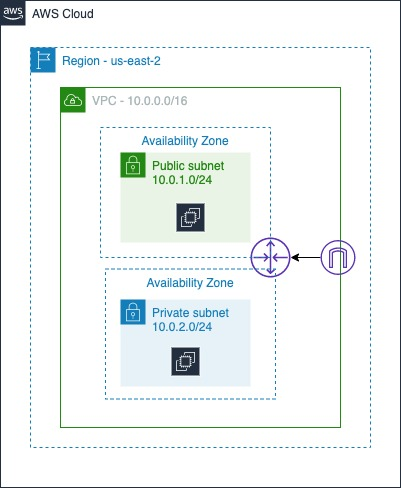

---

### Day 9 - Foundational & Compute Service

**Focus**: Today the learning focuses on EC2 basics and understanding some of the main features it offers. It also touches on storage, auto scaling and load balancing.

**Progress**:

EC2-Basics:

- Learned how to create EC2 instance
- Associate the instance with a security group that allows ssh traffic from any IP
- Create a snapshot of the EBS volume attached to the EC2 Instance
- Create an AMI using the snapshot
- Create a new instance using the AMI

Storage:

- Learn about the different storage class
- Create an EBS volume and attack it to instance
- Create an EFS filesystem and mount it to instance

S3 and IAM Role:

- Create an S3 bucket
- Create IAM Role with EC2 Service
- Attach AmazonS3FullAccess to policy
- Attach role when creating launch configuration

Auto scaling and Load Balancing

- Create launch configuration (useing ami-03657b56516ab7912)
- Create autoscaling group using the launch configuration
- Create target groups
- Create load balancer and have load balancer serves traffic to the instance
- Verify you can see webapp from your browser

**Thoughts**: No better way to start experimenting with AWS than EC2. Doing the lab was refreshing and it helped cement the concept for me. Navigating the console was a bit intimidating at first. With patience and dedication it became easier. Also Taking the time to draw the architecture prior immersing in the labs was instrumental in connecting the dots.

**Work & Resources**:

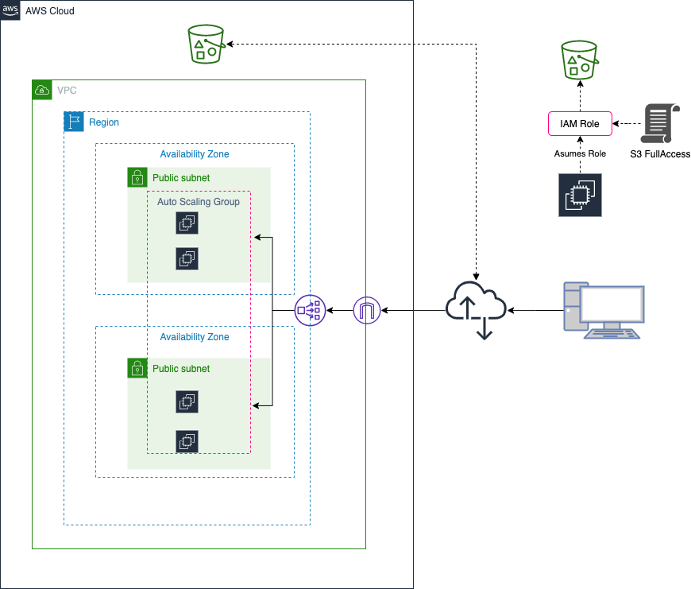

---

### Day 10 - Foundational & Compute Service

**Focus**: The learning today focused on AWS Lambda.

## **Progress**

- Learn the basic of Lambda
- Review the concept of lambda function, event source downstream resources, and log stream
- Create lambda function using the python runtime
- Creaye IAM roles to give the lambda EC2 and cloudwatch access
- Code the lambda function to start/stop an EC2 instance
- Playing around with environment variables

**Thoughts**: I spent a good amount of time experimenting with lambda function using python. I did things such as using the parameter passed to the function to stop and restart an instance. I even played around with API gateway. An API called was made to the lambda function to bring the intance up/down. I realized there are more to lambda than writing simple functions. It is one area I need to dedicate more time learning.

**Work & Resources**:

[Lambda Function](https://github.com/4zwazo/x-days-of-devops/blob/main/resources/code/lambda/start-start-ec2.py)

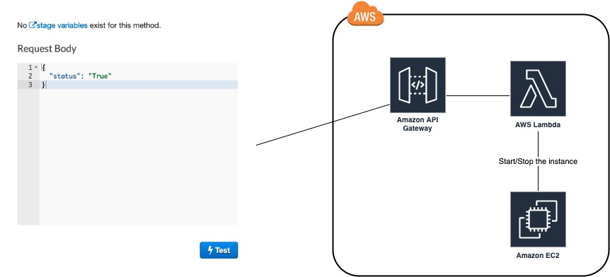

---

### Day 11 - AWS Management

**Focus**: The learning today focused on the AWS Command Line (CLI) Interface

**Progress**:

- Getting the raspberry pi up and running (no GUI)
- Install the AWS CLI SDK
- Playing around with the AWS CLI commands

**Thoughts**: Knowing which command to type to accomplish a tasks can be challenging. Reading the CLI documention is your best friend. You just have type experimenting with it. When you finally gets it, documenting somewhere.

**Work & Resources**:\
[AWS CLI on the Raspberry Pi](https://github.com/4zwazo/x-days-of-devops/blob/main/resources/cli/pi-install.md)\
[AWS CLI command reference guide](https://docs.aws.amazon.com/cli/latest/reference/)\
[AWS Command Line Interface (CLI)](https://docs.aws.amazon.com/cli/latest/userguide/cli-chap-welcome.html)

---

### Day 12 - Storage & Content Delivery

**Focus**: The learning today focused on S3, DynamoDB, RDS, and CloudFront.

**Progress**:

- Create a NoSQL database using DynamoDB
- Create a PostgreSQL database instance using RDS
- Connect and query the databases
- Create a S3 bucket and upload a simple web site to the bucket
- Create a CloudFront distribution for the website

**Thoughts**: I focused in making sure I understand the concept well. I have completed all the labs. It was well worth my time.

**Work & Resources**:
[Introduction to CloudFront](https://www.qwiklabs.com/focuses/14183?catalog_rank=%7B%22rank%22%3A1%2C%22num_filters%22%3A0%2C%22has_search%22%3Atrue%7D&parent=catalog&search_id=7804775)

---

### Day 13 - Security

**Focus**: The learning today was on security.

## **Progress**

- Create an IAM policy

**Thoughts** Today I read a few article about security in the cloud. This is an important topic I need to immerse myself further into.

**Work & Resources**:

[AWS Security Best Practices](https://d1.awsstatic.com/whitepapers/aws-security-best-practices.pdf)

---

### Day 14 - Messaging & Containers

**Focus**: The learning today was on SNS, SQS, and ECS.

## **Progress**

- Create a topic, Subscribe to a topic, and publish message to a topic
- Playing around with ECS and SQS

**Thoughts**: I had to spend a good chunk of time study SNS. It was a bit challenging getting the concept ingrained in my brain. As always when the learniing got tough, go to the drawing board save the day.

**Work & Resources**:
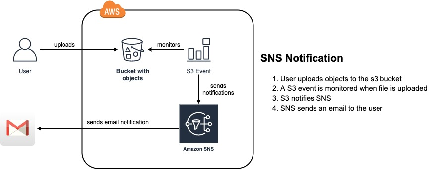

---

### Day 15 - AWS Management

**Focus**: The learning today focused on CloudTrail, CloudWatch, and CloudFormation

**Progress**:

- Create a CloudWatch event to notify via a SNS topic when an EC2 instance created
- Create a CloudFormation stack using the CloudFormation Designer
- Launch S3 bucket using Infrastructure as Code
- Save and deploy a CloudFormation stack
- View S3 Bucket created by CloudFormation Stack

**Thoughts**: Definitely the best way to get better working in the cloud is to read, create, practice. What do I mean by that? Read and understand the concept, come up with something, draw it on paper, and get your hands dirty.

**Work & Resources**:
[AWS CloudFormation](https://docs.aws.amazon.com/AWSCloudFormation/latest/UserGuide/Welcome.html)
[AWS CloudWatch](https://docs.aws.amazon.com/AmazonCloudWatch/latest/monitoring/WhatIsCloudWatch.html)
[AWS CloudTrail](https://docs.aws.amazon.com/awscloudtrail/latest/userguide/cloudtrail-user-guide.html)
[Cloud Formation](https://docs.aws.amazon.com/AWSCloudFormation/latest/UserGuide/Welcome.html)

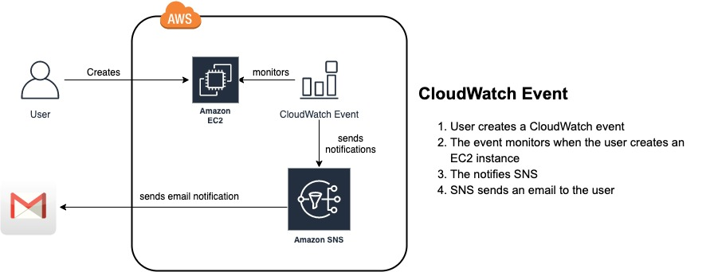

---

### Day 16 - AWS Management

**Focus**: The learning today focused on the AWS Command Line Interface (CLI)

**Progress**:

- Getting the raspberry pi up and running (no GUI)
- Install the AWS CLI SDK
- Configure the AWS Command Line Interface (CLI)
- Playing around with the AWS CLI commands

**Thoughts**: Knowing which command to type to accomplish a tasks can be challenging. Reading the CLI documention is your best friend. You just have type experimenting with it. When you finally gets it, documenting somewhere.

**Work & Resources**:\
[AWS CLI command reference guide](https://docs.aws.amazon.com/cli/latest/reference/)
[AWS Command Line Interface (CLI)](https://docs.aws.amazon.com/cli/latest/userguide/cli-chap-welcome.html)

---

# Cloud Fundamentals Project

### Day 17 - Deploy Static Website on AWS

**Focus**: The learning today was on deploying a static web site on AWS.

**Progress**:

- Create an s3 bucket and secures it using IAM Policy
- Create an A record for the website using Route53
- Distribute the web site via CloudFront

**Thoughts**: The bucket IAM policy got the best of me. I assumed granted public access to the bucket and all objects within the bucket acquired the same permissions automatically. I kept getting access denied and couldn't figure out the reasons for it. As always reading the AWS documentation helped arrived at the resolution.

**Work & Resources**:
[The Travel Blog](travel.sokibi.com)
[The Travel Blog via CloudFront](d1wq0wh5789j4s.cloudfront.net) <--- Disabled to manage cost>
[Setting permissions for website access](https://docs.aws.amazon.com/AmazonS3/latest/dev/WebsiteAccessPermissionsReqd.html)

---

# Deployment Infrastructure as Code

### Day 18 - Getting Started with CloudFormation

**Focus**: The learning today was focused on DevOps in general.

**Progress**:

- Understanding the problem that DevOops is trying to solve
- Understanding Infrastructure as Code
- Understanding Continuous Integration (CI), Continuous Delivery (CD), Continuous Deployment (CD)
- Getting familiar with DevOps tools such as configuration management tool like (Ansible, etc), deployment tools (Jenkins, Circle CI, etc)

**Thoughts**: It was worth it to take the time to read articles and listen to youtube videos on devops.

**Work & Resources**:\
[Continuous integration vs. continuous delivery vs. continuous deployment](https://www.atlassian.com/continuous-delivery/principles/continuous-integration-vs-delivery-vs-deployment)
[Integration and Continuous Deployment](https://css-tricks.com/continuous-integration-continuous-deployment/)
[DevOps Bootcamp](https://www.youtube.com/playlist?list=PLleOCN2eBn8IhLAckXL0BWomad5lrhB8j)

---

### Day 19 - Getting Started with CloudFormation

**Focus**: The learning today was on getting my hands dirty with the basic of cloud formation.

**Progress**:

- Learned about CloudFormation template and stack of resources
- Create a YML CloudFormation template
- Create a VPC Resource
- Running the template vis the CLI to create the stack
- Use the CLI to verify the stack created and VPC online

- **Thoughts**: Using cloudformation to create infrastructure is super important. I had fun playing around with CloudFormation.

**Work & Resources**:
[AWS::EC2::VPC](https://docs.aws.amazon.com/AWSCloudFormation/latest/UserGuide/aws-resource-ec2-vpc.html)
[AWS resource and property types reference](https://docs.aws.amazon.com/AWSCloudFormation/latest/UserGuide/aws-template-resource-type-ref.html)
[Intrinsic function reference](https://docs.aws.amazon.com/AWSCloudFormation/latest/UserGuide/intrinsic-function-reference.html)
[Pseudo parameters reference](https://docs.aws.amazon.com/AWSCloudFormation/latest/UserGuide/pseudo-parameter-reference.html)

---

### Day 20 - Infrastructure Diagrams

**Focus**: Todays learning focused on Converting business requirements into infrastructure diagrams and understand the principles behind the choice of the design.

**Progress**:

- Create a Lucid Chart Account
- Setting up a Lucid Chart
- using the diagrams to create a cloud environment

**Thoughts**: The diagram is an important step before writing the code for the environment. The diagram helps you to see where the location of services, subnets, route tables, and others within the cloud environment are.

**Work & Resources**:
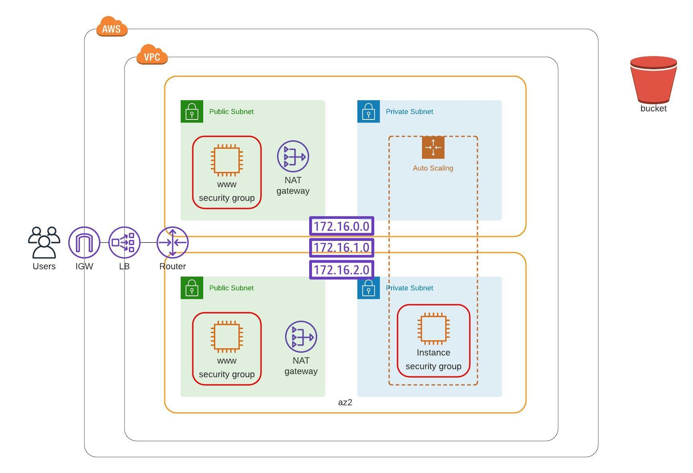

---

### Day 21, 22 - Reading on cloud Architecture

**Thoughts**: During the past two days I decided to read more on cloud architectures. The goal was to get deeper understanding of what the cloud is all about. To learn things like virtualization, load service and deployment models, serverless, etc.

**Work & Resources**:

[Cloud Computing Solutions Architect](http://www.hands-on-books-series.com/cloud-computing-solutions-architect.html)

---

### Day 23 - Task 1 - Create a diagram that represent a corporate-only cloud

**Focus**: The focus for today was on creating a hybrid cloud environment.

**Progress**:

- Getting familiar AWS diagrams
- Using the previous day diagram and tailor it for a hybrid architecture

**Thoughts**: Today's task involves converting the business requirements into infrastructure diagrams. Once I understand the requirements, it was pretty easy to construct the diagram. It would have been more fun if I worked with another peer on this project.

**Work & Resources**:
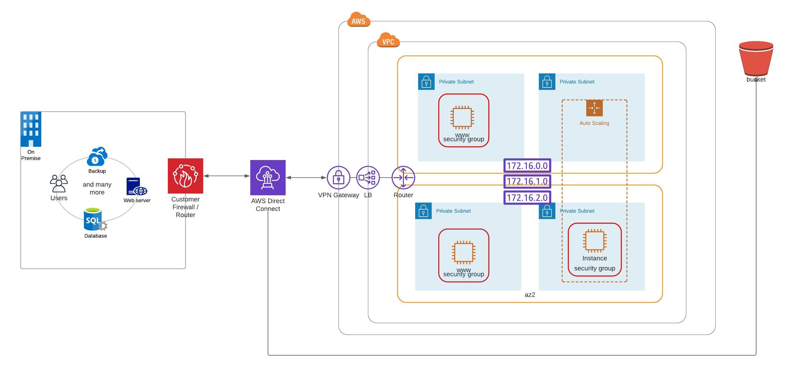

---

### Day 24 - Networking Infrastructure

**Focus**: The focus for today was converting the diagram I worked on Day 14 to code.

**Progress**:

- Create the cloudformation stack which include the VPC
- Update the stack by adding NET Gatwway, Subnet, and routing
- create an create.sh and update.sh script for creating and updating the stack

**Thoughts**: Today's task involves converting the infrastructure diagram to code. This is definitely something i need to keep on doing.

**Work & Resources**:

[Intrinsic function reference](https://docs.aws.amazon.com/AWSCloudFormation/latest/UserGuide/intrinsic-function-reference.html
)
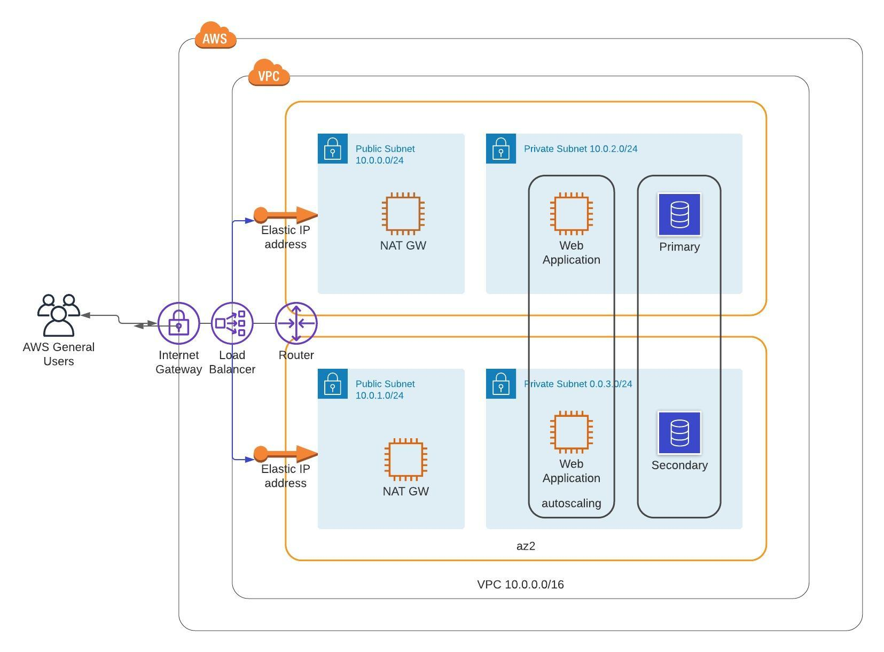

---

### Day 25 - Servers and Security Groups

**Focus**: Add the necessary components to start deploying servers, application, etc. This is the continuation of the work completed in day 16

**Progress**:

- Creating the security group
- Creating autoscaling group and launch configuration
- Getting familiar and interpreting errors, and steps to fix them

**Thoughts**: It is a joy getting hands-on experience create the code that implements the environment. I purposely made errors during  code. that forced me to learn about how cloudformation works. In addition to research and learn what these errors mean.

**Work & Resources**:

[Security Group Rules Reference](https://docs.aws.amazon.com/AWSEC2/latest/UserGuide/security-group-rules-reference.html)

---

### Day 26 - Servers and Security Groups

**Focus**: Practice creating environment using cloudformation

**Progress**:

- Creating the network infrastructure
- Secure the infrastructure
- Creating EC2 instance
- Deplay an application

**Thoughts**: This just to practice and build confidence.

**Work & Resources**:

- N/A

---

### Day 27 - Storage and Databases

**Focus**: Adding RDS Database to the infrastructure

**Progress**:

- Create an MySQL database
- Configure the database for replication
- Connecting to the database

**Thoughts**: Setting up the database to prevemt single point of failures makes the environment more robust. Today's learning really stressed that point. Also adding the database in the private subnet provide additional security that prevent unauthorize access to teh data.

**Work & Resources**:

---

## Day 28 - Task 1 - Convert diagram's infrastructure to code

**Focus**: Reviewing what I have learned from the past few days. Now deploying an Amazon RDS database in a single AZ.

**Progress**:

- Creating VPC
- Creating Internet Gaway
- Creating Subnets
- Creating Route and Route Tables

**Thoughts**: The goal here is to review the learniing and practice what i have learned over the pass several days.

**Work & Resources**:
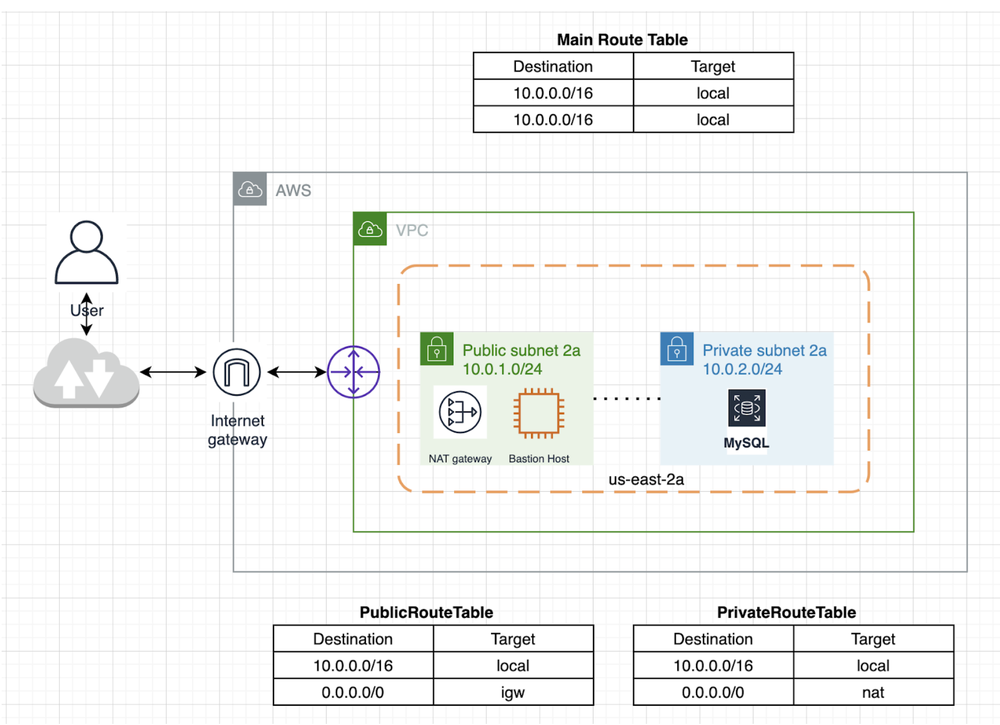

---

## Day 29 - Task 1 - Convert diagram's infrastructure to code

**Focus**: completed the code for the networking part of day 20

**Progress**:

- Creating the NAT gateway
- Creating the Private Route table
- Attaching Route table to subnets

**Thoughts**: The goal here is to review the learniing and practice what i have learned over the pass several days.

**Work & Resources**:

---

## Day 30 - Task 1 - Convert diagram's infrastructure to code

**Focus**: adding an RDS MySQL database and redraw the infrastructure diagram. The work involve deploying an Amazon RDS database in a single AZ.

**Progress**:

- Create DB subnet group
- Create RDS DB instance

**Thoughts**: I learned an important lesson today. No matter how much you read, you don't know you know until you create something to practice what you have learned. Here is the story. I spent hours trying to create the MySql RDS instance in the diagram (Day 20). It wouldn't work. It turns the diagram is missing a few pieces. RDS needs at least two subnets in two availability zones. One subnet for the primary and the other for the replicated database. To solve my problem the design needs an additional AZ and at least one subnet.

**Work & Resources**:
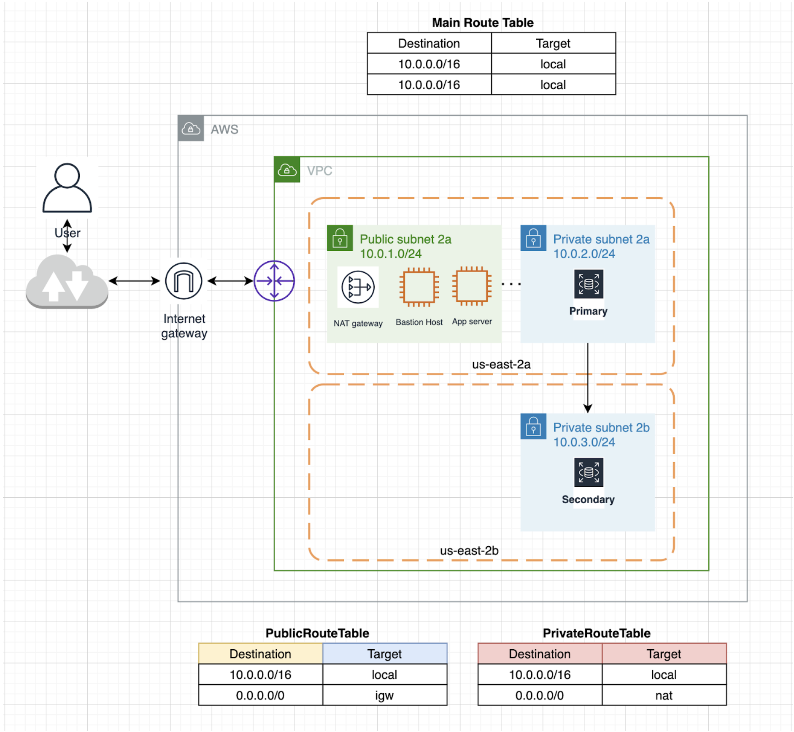

---

## Day 31 - Task 1 - Convert diagram's infrastructure to code

**Focus**: Completed the coding for the RDS part of the task

**Progress**:

- Adding/revising codes for the DB subnet group
- Adding code for the additional subnet
- Adding/revising codes dor the RDS instance

**Thoughts**: The final infrastructure is not optimal. But the point of this exercise is to simply practice writing cloudformation codes and understand the technology a bit deeper.

**Work & Resources**:

[Infrastructure YML file](https://github.com/plezidevops/devops/blob/main/resources/code/cloud-formation/task01/infrastructure.yml)

[Servers YML file](https://github.com/plezidevops/devops/blob/main/resources/code/cloud-formation/task01/servers.yml)

---

# Project

---

## Day 32 - Deploy a high-availability web app using CloudFormation

**Focus**: Creating architecture diagram

**Progress**:

- Create architecture diagram based on the project requirements
- Create repo for the project
- Push initial version to github

**Thoughts**: Creating the diagram takes a bit of time than anticipated.

**Work & Resources**:

[Project Repository](https://github.com/pascallaurent/landscaping)

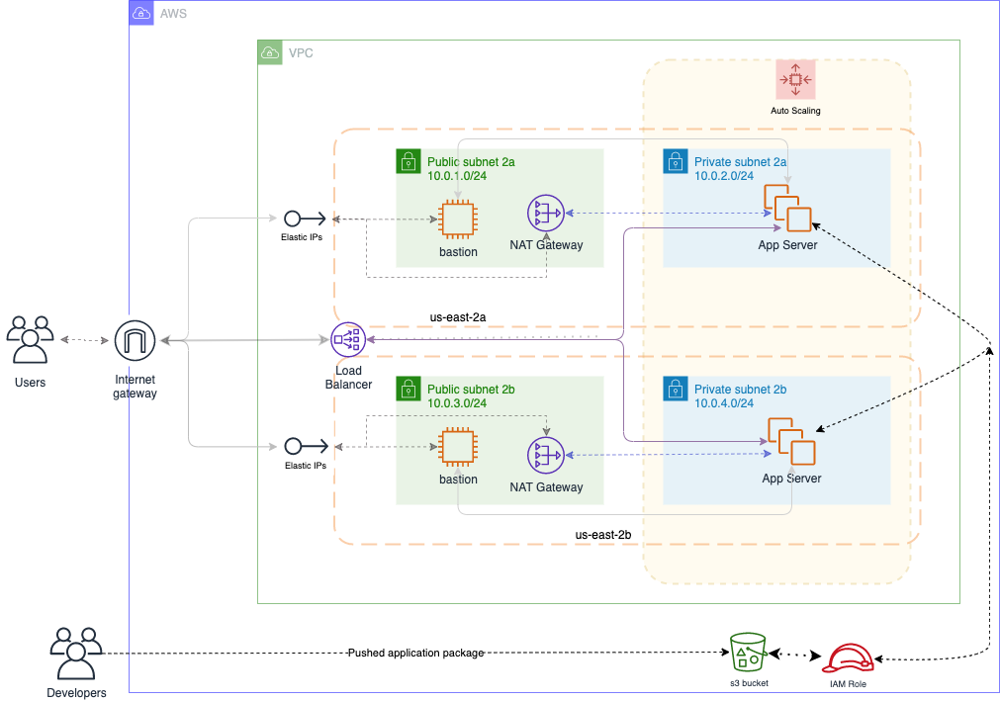

---

## Day 33 - Deploy a high-availability web app using CloudFormation

**Focus**: Start coding the infrastructure

**Progress**:

- Code network components
- Code the load balancer and Launch configuration
- Code the bastion host

**Thoughts**: Today I spent a production 1+ hours working on coding the infratrcuture. Getting all the pieces to connect can be challenging sometimes. My best option when I can't seem to figure things out is the drawing board. Well today the drawing board has saved some headache while working on the route tables.

**Work & Resources**:
[Project Repository](https://github.com/pascallaurent/landscaping)

---

## Day 34 - Elastic load balacer and auto scaling

**Focus**: Playing aroung with load balacing and auto scaling

**Progress**:

- Create an application load balancer and Launch configuration
- Create IAM policy
- Launch a basic web application

**Thoughts**: Taking the day to practice creating high-availability architecture

**Work & Resources**:

---

## Day 35 - Completed the project

**Focus**: Completed the deployemnt of the landscaping project

**Progress**:

- Creating Create Role, Policy, and profile
- Troubleshooting security group settings that prevent the app render in the browser
- Clean the code

**Thoughts**: The focus today was on completing the 2nd project

**Work & Resources**:

[Project Repository](https://github.com/pascallaurent/landscaping)

---

# Build CI/CD Pipelines, Monitoring & Logging

---

## Day 36 - Continuous Integration and Continuous Deployment

**Focus**: Understanding CI/CD Pipelines, Monitoring, and Logging and getting our environment.

**Progress**:

- Learn about the building blocks of development, monitoring, and deployment
- Create infrastructure using cloud formation to practice devops related works
- Create IAM policies, group, and devops accounts

**Thoughts**: Today's learning focuses on a number of topics, such as the importance of CI/CD Pipilines during the development and deployment phase (using Jenkins), on creating environment using Ansible, and monitoring/maintaining the infrastructure using tools like Prometheus and ELK.

**Work & Resources**:

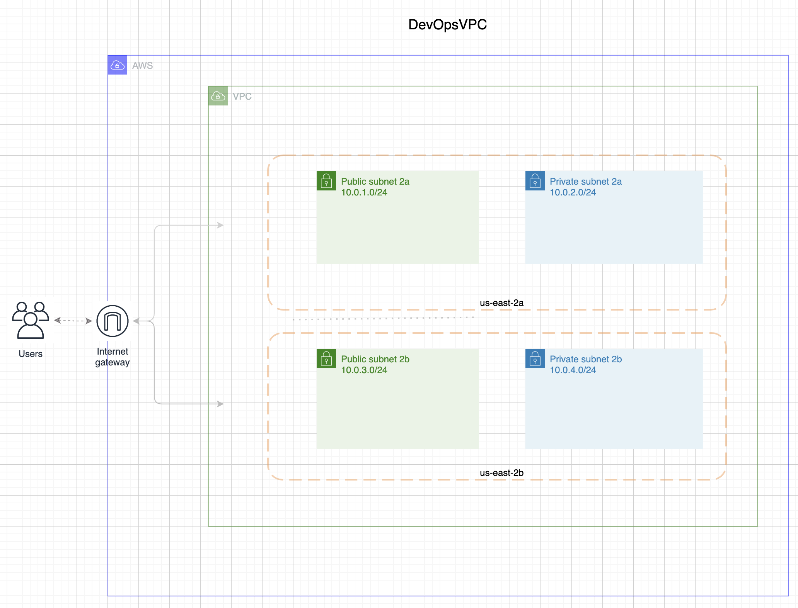

---

## Day 37 - Getting Jenkins up and running

**Focus**: Getting Jenkins up and running

**Progress**:

- Getting the EC2 instance Jenkins server running
- Installing the Nginx server
- Configure Nginx as a proxy to access Jenkins HTTP requests
- Installing the Blueocean plugin

**Thoughts**: Today's lesson was pretty cool. Configured the Nginx server was a bit challenging. I need to educate myself more about Nginx. It could have been easier with Apache. I am glab I went along with Nginx.

**Work & Resources**:

[Jenkins Installation documentation](resources/code/nginx/install.md)

---

## Day 40 - What is this CI/CD stuff all about

**Focus**: Understanding how the delivery of software works

**Progress**:

- Read and understand what Continuous integration is
- Read and understand the difference between Continuous Delivery and Deployment
- Read and understand Jenkins roles in CI/CD

**Thoughts**: Often times we are learning new technologies without taking the time to understand and masticate the concepts. These pieces of technologies are there to help us solve problems. So this is what i decided to do this morning. Hit the brakes, use my one hour, and read stories on CI/CD.

**Work & Resources**:
N/A

---

## Day 41 - Continuous Integration and Continuous Deployment Strategies

**Focus**: Configure Jenkins to talk to S3 and github

**Progress**:

- Install AWS Steps plugin
- Create github repo
- Create new pipeline using Blue Ocean

**Thoughts** The project I worked on today involved creating a pipeline that monitors a github repo for file, takes the file and uploaded it to a S3 bucket. The challenging part is configured Jenjins to do the work. I had to do the project a few times to really understand and grasp the concept. As always hands-on learning is surely the way to go about doing it
-Jenkins

**Work & Resources**:

[From Github to jenkins to S3](https://github.com/pascallaurent/s3_jenkins_devops)

---

## Day 42 - Continuous Integration and Continuous Deployment Strategies

**Focus**: Build a Jenkins pipeline to upload a file to S3

**Progress**:

- Adding different stage to the pipeline
- Testing to make sure pipeline works as expected
- Troubleshooting S3 related issues

**Thoughts** Today's learning was pretty fun. It was great to see how the pipeline transition from stage to stage during deployment and delivery process. One issue I had to deal with is S3. The Upload to S3 stage kept failing even though the file uploaded accordingly. This is something I need to continue working on to fix

**Work & Resources**:

[From Github to jenkins to S3](https://github.com/pascallaurent/s3_jenkins_devops)

---

## Day 43 - Continuous Integration and Continuous Deployment Strategies

**Focus**: Doing some practice exercises

**Progress**:

- Install Jenkins plugin AWS CodePipeline.
- Set up AWS credentials with access key and secret access key
- Create a S3 bucket
- Set up a pipeline
- Pipeline code for performing the Tidy check
- Add pipeline code to upload file to S3

**Thoughts** Decided to do additional practice to cement the learning

**Work & Resources**:

[Hello World Pipeline](https://github.com/pascallaurent/Hello_World_Pipeline)

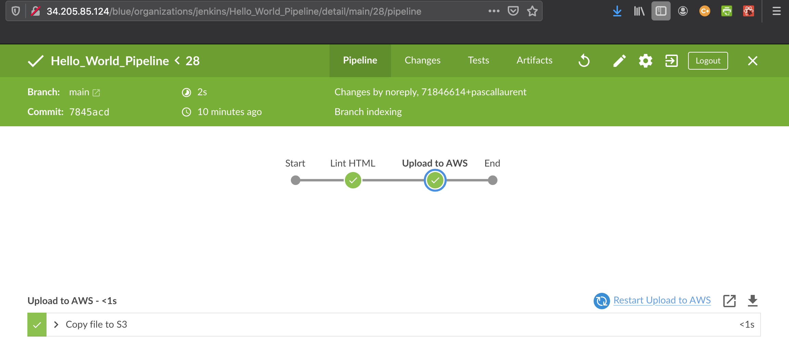

---

## Day 44 - Ansible: what and why

**Focus**: Understanding what ansible is and why

**Progress**:

- An IT automation engine
- Configuration management, Provisioning, Application Deployment, and Orchestration
- Simple, Agentless, secured, and powerful
- Efficient, Open source, and flexible
- Control node and Managed node

**Thoughts** My one hour learning is spent on reading whatc Ansible is all about and how it works.

**Work & Resources**:

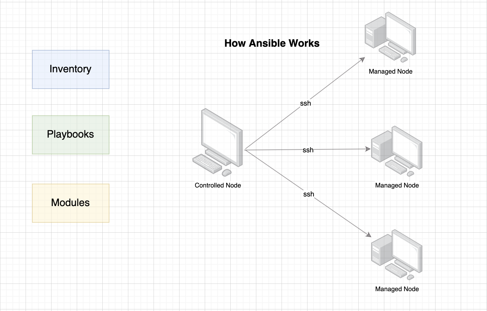

---

## Day 45 - Prepare Ansible Control Node environment

**Focus**: Prepare the Ansible control node environment

**Progress**

- Setup the Control Node using an Ec2 Instance (RedHat)
- Chnage host name
- Create ansadmin user and Add user to sudoer
- Create SSH key
- Enabled Password Basecd authentication

**Thoughts** My one hour today focuses on getting the environment ready for ansible. It involves lots of manual configurations on the RedHat server.

**Work & Resources**:

---

## Day 46 - Prepare Ansible Managed Node environment

**Focus**: Prepare managed node on RedHat Linux, installing ansible, setup SSH, and issuing ad-hoc commands

**Progress**:

- Setting up the managed node
- Installing Ansible on the control node EC2 instance
- Setup Ansible configuration file
- Setup the nodes for password less configuration
- Issuing ad-hoc command

**Thoughts** My one hour is spent on seeting up the managed node and making sure the control node can communicate with it.

**Work & Resources**:
[Ansible environment](https://github.com/plezidevops/devops/tree/main/resources/code/ansible)

---

## Day 47 - Ansible Inventory and ad-hoc commands

**Focus**: running ad-hoc commands and playing with ansible inventory

**Progress**

- Running more ad-hoc commands
- Create inventory file
- Create inventory groups

**Thoughts** It super amazing how ansible makes it easy to control managed node. I have a blast playing around with ansible issuing remote commands.

**Work & Resources**
[Ansible environment](https://github.com/plezidevops/devops/tree/main/resources/code/ansible/docs)

---

## Day 48 - Continue with my DevOps learning

**Focus**: Re-focus on ansible after a long pause.

**Progress**

- setup 3 headless raspberry pi as my lab to practice ansible
- Installing Ansible in control node
- configure control node to connect to managed node
- Run ansible ping command from control to managed nodes

**Thoughts** For the past few weeks I was working on a major upgrade which prevented me from focusing on my devops journey. The goal is learning not too rush. I put it aside for while. Now I am back. I switch to raspberry pi due to its cost saving. It was also fun to work on this lab. For this project I used 3 rapsberry pi zero.

**Work & Resources**
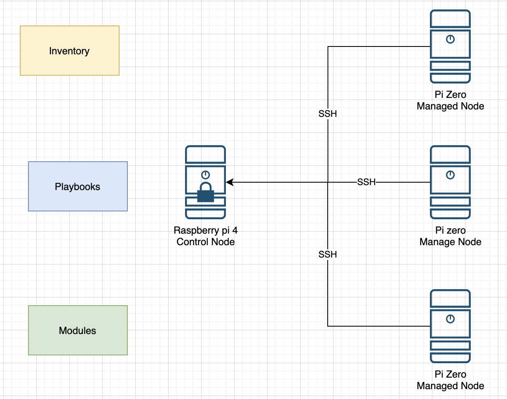

---

## Day 49 - Ansible components

**Focus**: Today's learning focuses on ansible inventory, modules, and how to execute ad-hoc commands

**Progress**:

- Using various ansible modules to communicate with managed nodes
- Understanding enventory and how to create groups
- Working with custom and default inventory file

**Thoughts**: It was pretty fun learning the different ways to work with inventory files. I fast foroward a bit, reading the document and translate playbook tasks into ad-hoc commands. That was pretty cool.

**Work & Resources:**

[ad hoc commands](https://github.com/plezidevops/devops/blob/main/resources/code/ansible/5-ad-hoc-commands.md)

[inventory](https://github.com/plezidevops/devops/blob/main/resources/code/ansible/6-inventory.md)

---

## Day 50 - Ansible playbooks

**Focus**: The learning today focused on ansible playhook

**Progress**:

- convert an ad-hoc command to a playbook
- executed the playbook
- understanding ansible playbook Output from the command line

**Thoughts**: Today was another fun day experimenting with playbook.

**Work & Resources:**

[inventory](https://github.com/plezidevops/devops/blob/main/resources/code/ansible/7-playbook.md)

---

# Day 51 - Ansible module

**Focus**: The learning today focused on ansible module

**Progress**:

- Using modules to create an ansible playbook
- The different ways run an ansible playhook from the command line
- create playbooks to install packages
- Create playbook to copy, create, and delete files/directories

**Thoughts**:

**Work & Resources:**: Today was a hands-on learning day. I got to experiment with several andible models. The ansible documentation is super helpful. Each module has lots of examples following brief description of what the module does. It was super fun playing with ansible.

[inventory](https://github.com/plezidevops/devops/blob/main/resources/code/ansible/8-modules.md)

---

# Day 52 - Multitask Ansible Playbooks

**Focus**: How to run multiple tasks in playbook

**Progress**:

- Create multiple tasks to install/start/stop/remove the lighttpd server
- create a custom ansible.cfg configuration file

**Thoughts**:

**Work & Resources:**: Today's learning was pretty short. I have already include multiple tasks on previous days. Reviewing it again help cement certain concepts i didn't understand.

[inventory](https://github.com/plezidevops/devops/blob/main/resources/code/ansible/9-multitasks.md)

---

# Day 53 - Ansible notify and handlers, and when conditionals

**Focus**: Today's learning focuses on notify and handlers, and using teh when conditionals

**Progress**:

- Using notify and handlers
- Set  facther_facts=no to disable gathering of node information before executing tasks
- Using the when conditionals

**Thoughts**: What so cool about hands-on learning is the fact you are doing it and see the results instantaneously.

**Work & Resources:**:

[notify and handlers](https://github.com/plezidevops/devops/blob/main/resources/code/ansible/10-notify-handlers.md)

[when](https://github.com/plezidevops/devops/blob/main/resources/code/ansible/11-when.md)

---

# Day 55 - Ansible variables

**Focus**: The learning today focused on using variables with ansible playbooks

**Progress**:

- Define variables in the playbook
- Passing variables from external files
- Passing variables while running playbook

**Thoughts**: This was short lesson, but very important.

**Work & Resources:**:
[Ansible variables](https://github.com/plezidevops/devops/blob/main/resources/code/ansible/12-variables/md)

---

# Day 56 - Using tags and handling errors

**Focus**: The focus today is on using tags and ignore errors

**Progress**:

- How to use tags in playbook
- Using ignore_errors

**Thoughts**: Tags make playbooks more dynamic. If an error occurred while the playbook is executing, errors can be ignored and the process continues.

**Work & Resources:**:
[Ansible Tags](https://github.com/plezidevops/devops/blob/main/resources/code/ansible/)

---

# Day 57 - Vault and Roles

**Focus**: The focus today was on vault and roles

**Progress**:

- Encrypt and decrypt passwords using ansible vault
- using encrypted password in playbook
- convert playbook to roles

**Thoughts**:Today learning was pretty cool. I mostly play around with ansible roles. It surely makes the automation procerss more cleaner.

**Work & Resources:**:

---

# Day 58 - Reviewing before moving on to Build Tools for Devops

**Focus**: Taking all the stuff I have learned over the past few days and worked on a small project. I am using role to install lighttpd on both debian and Redhat variants.

**Progress**:

- Create ansible role
- Adding Fedora Linux to the ansible lab
- configured Fedora Linux as a managed node

**Thoughts**: Working on a small project that serves as a review for what I have learned over the past few days. Now I am ready to move on to monitoring.1

**Work & Resources:**:
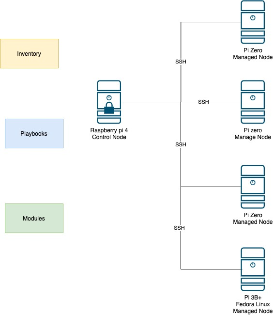

---

# Build & Package Manager Tools

---

# Day 59 - Build Tools and Package Managers

**Focus**: Learning and using build and package managers tools

**Progress**:

- Understand artifacts
- Using Maven, Gradle, and npm to package applications
- Review my responsibilities as a devops engineer

**Thoughts**: I am pretty much familiar with these tools. I have been using them from time to time at my job.

**Work & Resources:**:

# Day 60 - Cloud and IaaS

**Focus**: Using the DigitalOcean cloud services to deploy a java application

**Progress**:

- Setup a DigitalOcean Ubuntu server (Droplet)
- Install Java on the Server
- Deploy and run a java application on Cloud Server
- Create a Linux User to login to Server (instead of using Root User)

**Thoughts**: DigitalOcean cloud server is super simple compare to AWS EC2 instance. It was refreshing using a linux environment to deploy this simple app.

**Work & Resources:**:
[Application Deployment using DigitalOcean]([Ansible Tags](<https://github.com/plezidevops/devops/blob/main/resources/code/cloud-iaas/>)

---

# Artifact Repository and Manager with Nexus

---

# Day 61 - Nexus - concept and practice

**Focus**: Understanding what nexus is all about as well as install and configure it

**Progress**:

- Review what an artifact is
- Understand artifact repository and manager
- Create a new droplet
- Install java
- Install and configure Nexus
- Connecting to Nexus

**Thoughts**: Today was all about understanding the concept of artifact repository and manager. The rest was hands-on learning. I worked on downloading, configuring, and running Nexus.

**Work & Resources:**:
[Application Deployment using DigitalOcean]([Ansible Tags](https://github.com/plezidevops/devops/blob/main/resources/code/cloud-iaas/)

---

# Day 62 - Deployment and publishing of artifacts to Nexus

**Focus**: Using Nexus UI, creating user and role, and deploy artifacts

**Progress**:

- Getting familiar with the Nexus UI
- Creating user and role
- Configure java applications to connect to Nexus
- Published artifacts to Nexus

**Thoughts**: I have lots of fun with nexus, gradle and maven. It was refreshing having to create builds and published them to Nexus.

**Work & Resources:**:
[Java gradle application]([Ansible Tags](https://github.com/pascallaurent/java-gradle-app)
[Java maven application]([Ansible Tags](https://github.com/pascallaurent/java-maven-app)

---

# Day 63 - Nexus API

**Focus**: Nexus API

**Progress**:

- Understanding Nexus API
- Using the API to list repos
- Show all the components in the maven-snapshots repo
- understanding Blob store

**Thoughts**: This is a short lesson focus on interacting with the Nexus API. Needs to go and enjoying Easter. I will continue with the learning tomorrow.

**Work & Resources:**:

---

# Day 64 - Nexus Blob Stores

**Focus**: Blob stores

**Progress**:

- Creating Blob Stores
- Assets vs Components
- Creating blob store
- Create clean up policy
- Attach policy to repository
- Creat compact store task to free up blob space
- Execute the clean up service task to clean up repo
- Execute compact-store to free up blob space

**Thoughts**: I definitely need to come back and lean more about Nexus.

**Work & Resources:**:

---

# Containers with Docker

---

# Day 65 - Docker fundamentals

**Focus**: docker fundamentals

**Progress**:

- Docker architecture
- Docker image vs container
- Installing docker
- Using docker commands to Pull images, run containers, and more
- Familiarize with docker commands

**Thoughts**: Cleared up some confusion by understanding what a docker container is as well as docker image.

**Work & Resources:**:

[Installing Docker on MacOS](https://github.com/plezidevops/devops/blob/main/resources/code/docker/)

---

# Day 66 - developing an application with Docker

**Focus**: developing a simple user profile app

**Progress**:

- Pull and run mongo and mongo-express
- create docker network
- Start mongo and mongo-express
- Connect to mongo-express
- configure application
- start application

**Thoughts**:

**Work & Resources:**:

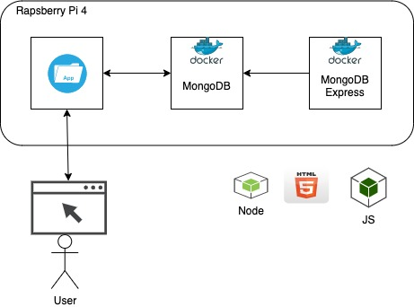

[Configure and start application](https://github.com/plezidevops/devops/blob/main/resources/code/docker)

[js demo application](https://github.com/pascallaurent/js-demo-app)

---

# Day 67 - Docker compose

**Focus**: Running multiple services with docker compose

**Progress**:

- Create docker compose file
- Start container using docker compose
- Interpreting the log docker-compose generates

**Thoughts**:

**Work & Resources:**:

---

# Day 68 - Docker Image

**Focus**: Building image with Dockerfile

**Progress**:

- Simulate a CI/CD pipeline manually
- Creating dockerfile
- Build docker image
- Push image to an AWS ECR
- Pull image from dev server and deploy it

**Thoughts**: There so much you can do with Docker. It is an amazing tool. So far I only scratch the surface. This is a tool I need spend lots of time experimenting with.

**Work & Resources:**

This lab has been simulated manually. No actual jenkins server was setup. It was manually done at the CLI.

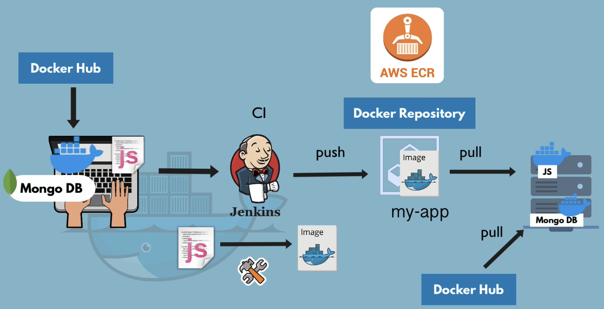

---

# Day 69 - Docker volume and repo

**Focus**: Docker volumes and Nexus docker repo

**Progress**:

- Understand how docker volumes works
- Learned about host, anonymous, and name volume
- Practice creating name volume
- Create Nexus docker repo

**Thoughts**: This was an educational hands-on learning session.

**Work & Resources:**

[Docker volume and repo](https://github.com/plezidevops/devops/blob/main/resources/code/docker/)

---

## Taking a week to do more hands-on practice with docker

---

### Review 1: How docker works

**Focus**: Understanding Docker and Running Hello World

**Progress**:

- Docker architecture
- Review container vs image
- Understand what a container is
- Making sense of a docker command
- Lab to copy a file from the host to container

**Thoughts**: This review really help me understanding docker and how it works.

**Work & Resources:**

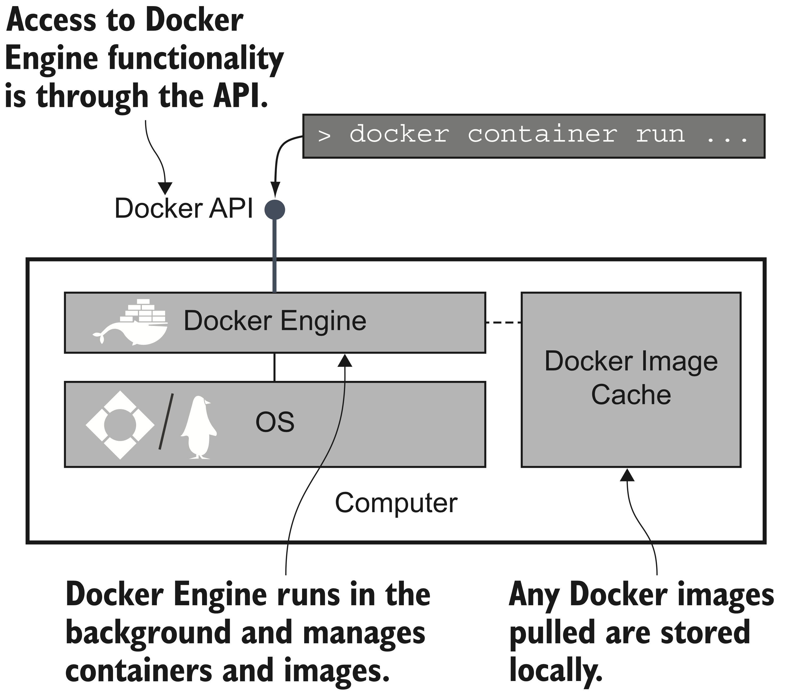

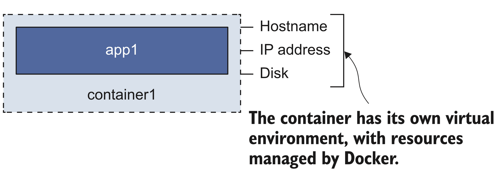

---

### Review 2: Docker images

**Focus**: Building my own docker images

**Progress**:

- Obtaining docker images from docker hub
- Experimenting with environment variables
- Writing my own Dockerfile
- Building my own docker image
- Understand image layers
- How to optimize Dockerfile
- Lab: produce a Docker image without a Dockerfile

**Thoughts**: It was fun packaging my image to in docker. The lab got the best of me at first. Playing around with the docker container command helped along the way.

**Work & Resources:**

[Review 2: Docker images](https://github.com/plezidevops/devops/tree/main/resources/code/docker/labs/review-2)

---

### Review 3: Packaging applications

**Focus**: packaging applications from source to code using docker

**Progress**:

- Understand multi-stage Dockerfile
- Creating using multi-stage Dockerfile
- packaging java, node, and go applications
- Setup docker network for containers to communicate among themselves
- lab

**Thoughts**: It was a pretty cool experimenting with running a distributed application across three containers.

**Work & Resources:**
[Multi stage docker](https://github.com/plezidevops/devops/tree/main/resources/code/docker/exercises/multi-stage)

---

# Jenkins as a docker container

---

# Day 70 - Understand and Install Jenkins

**Focus**: Jenkins overview and installation

**Progress**:

- Understand what Jenkins is all about
- Understand what jenkins help you do
- Build automation and benefits
- Installing and configure jenkins

**Thoughts**: This was an educational hands-on learning session. Enjoying the challenges of installing jenkins on PI4 as docker container.

**Work & Resources:**
[Multi stage docker](https://github.com/plezidevops/devops/tree/main/resources/code/jenkins)

---

# Day 71 - Jenkins jobs

**Focus**: Jenkins overview and installation

**Progress**:

- Install plugins
- Install nodejs at the container shell
- Create jobs that run simple commands
- Create jobs that interact with git repo
- Create job that checkout a java application, run test on it, build jar file
- Learn how to read and interpret errors in the job log

**Thoughts**: Today was pretty cool and I enjoy the learning.

**Work & Resources:**
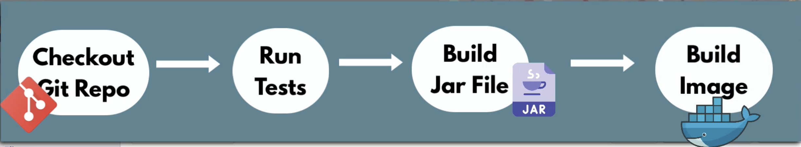

---

# Day 72 - Jenkins and docker

**Focus**: Kenjins, configuration, and docker

**Progress**:

- create docker account
- Jenkins job that checkout java application, run test, build jar, build image, push image to docker

**Thoughts**: Ran into a few issues configuring Jenkins credentials. Overall it was another successful learning.

**Work & Resources:**
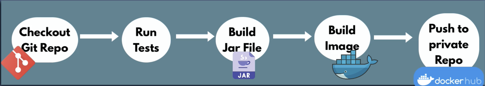

---

# Day 73 - Jenkins Pipeline

**Focus**: Jenkinsfile, groovy script, and input parameter

**Progress**:

- create jenkins pipeline job
- Jenkinsfile calling external groovy script
- job simulates different build stages

**Thoughts**: Another great learning today and fun working with jenkinsfile. It might be worth learning the Groovy programming language.

**Work & Resources:**

[Jenkins file and groovy](https://github.com/plezidevops/devops/tree/main/resources/code/jenkins/jenkinsfile)

---

# Day 74 - Jenkins Pipeline

**Focus**: troubleshooting pipeline issues

**Progress**:

- fixing
- Jenkinsfile calling external groovy script
- job simulates different build stages

**Thoughts**: Another great learning today and fun working with jenkinsfile. It might be worth learning the Groovy programming language.

**Work & Resources:**

[Jenkins file and groovy](https://github.com/plezidevops/devops/tree/main/resources/code/jenkins/jenkinsfile)